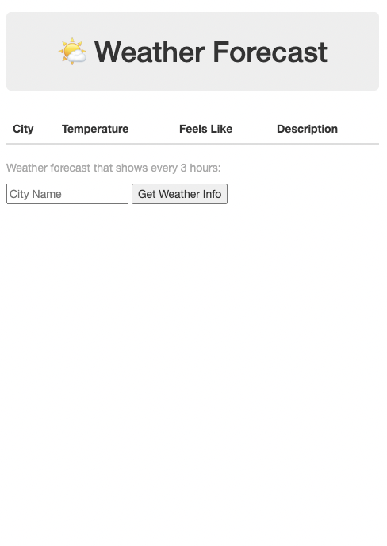
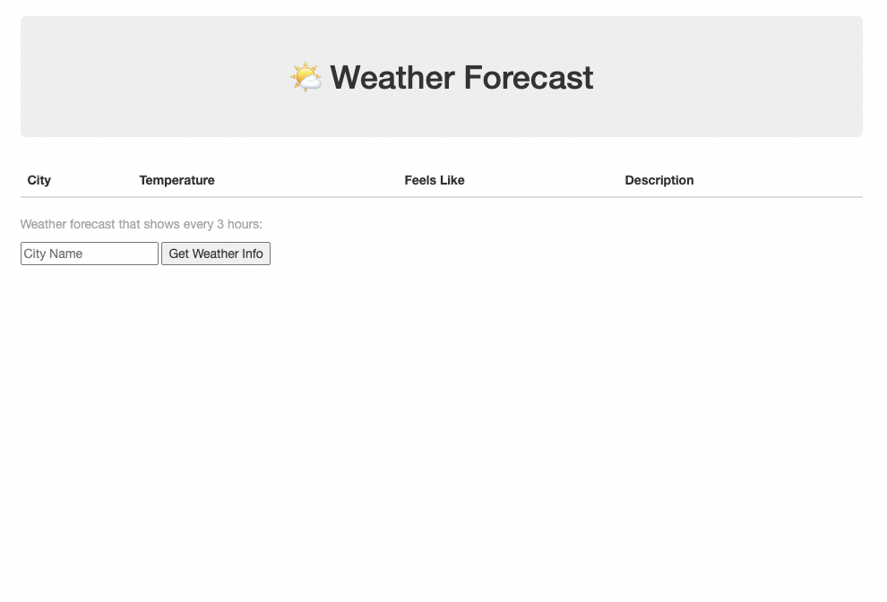

# 🌤 Weather Forecast

A simple web app for visualizing Weather Forecast up to 5 days.

## Technologies
- HTML5
- CSS3
- JavaScript/jQuery
- [Weather Forecast API](http://openweathermap.org/forecast16)
- BootStrap

### Wireframes

### Images of working App

##

### Getting Started
[Click here](https://avisa-ga.github.io/first-web-app-project/)

## Future Enhancement
- The abilty to share the result with other users.
