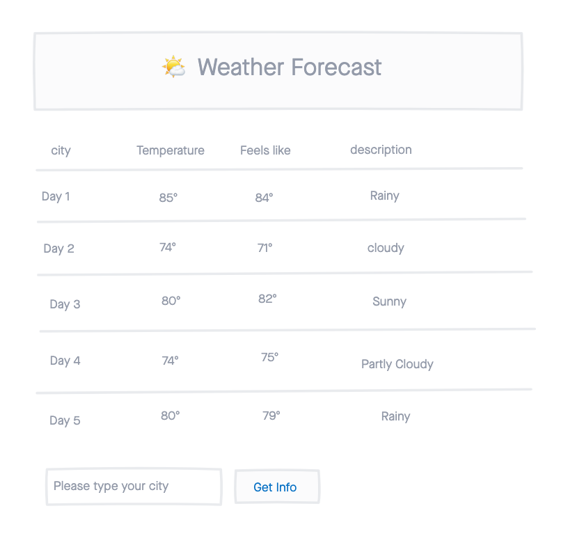

# 🌤 Weather Forecast

A simple web app for visualizing Weather Forecast up to 5 days.

## Technologies
- HTML5
- CSS3
- JavaScript/jQuery
- [Weather Forecast API](https://openweathermap.org/forecast16)
- BootStrap

### Wireframes

### Images of working App
 

### Getting Started

## Future Enhancement
- let user pick the city
- according to what city user pick will show 5 days weather
