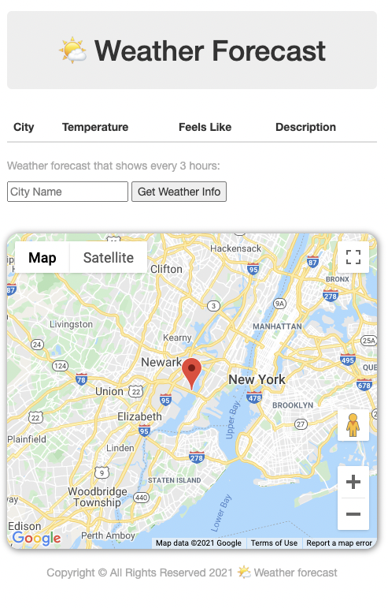
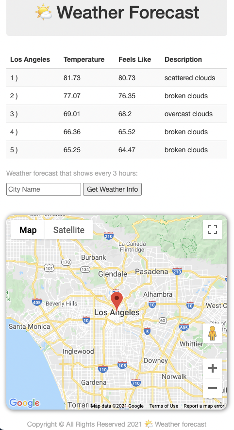

# 🌤 Weather Forecast

My project is about to show every 3 hours for the next 15 hours weather forecast of selected city by the user. and also user will be able to see the location in the map.
and when my app run for the first time map will show the random city location in the map from default cities that I added to project. so everytime user refresh the app map will shows one of default cities.

## Technologies
- HTML5
- CSS3
- JavaScript/jQuery
- [Weather Forecast API](http://openweathermap.org/forecast16)
- [Bootstrap](https://getbootstrap.com)
- [Google map](https://developers.google.com/maps/)

### Wireframe

##

### Images of working App
 #### Desktop version
 

 #### Mobile version

##

## Getting Started
[Click here](https://avisa-ga.github.io/first-web-app-project/)

## Future Enhancement
- The abilty to share the result with other users.
